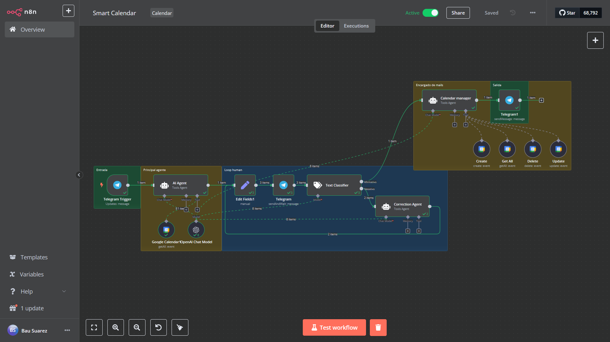

# Smart Calendar Assistant

## What is it?

A smart assistant that connects Telegram with Google Calendar using n8n. It allows you to manage events (create, retrieve, update, delete) conversationally with the help of AI.

## Requirements

- **n8n instance**: Local or cloud-based.
- **Telegram bot token**: Obtain from BotFather on Telegram.
- **Google Calendar credentials**: Set up via OAuth2.
- **OpenAI key**: Optional, for enhanced AI capabilities.

# Asistente Inteligente de Calendario

## ¿Qué es?

Un asistente inteligente que conecta Telegram con Google Calendar utilizando n8n. Permite gestionar eventos (crear, recuperar, actualizar, eliminar) de manera conversacional con la ayuda de IA.

## Requisitos

- **Instancia de n8n**: Local o en la nube.
- **Token de bot de Telegram**: Obtenido de BotFather en Telegram.
- **Credenciales de Google Calendar**: Configuradas mediante OAuth2.
- **Clave de OpenAI**: Opcional, para capacidades avanzadas de IA.

